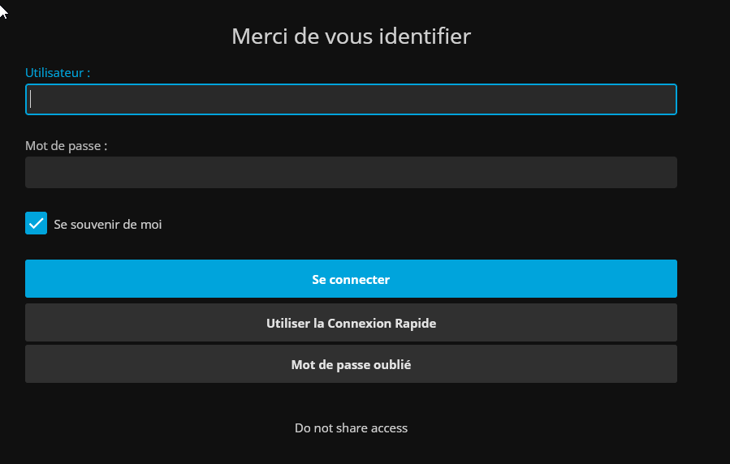
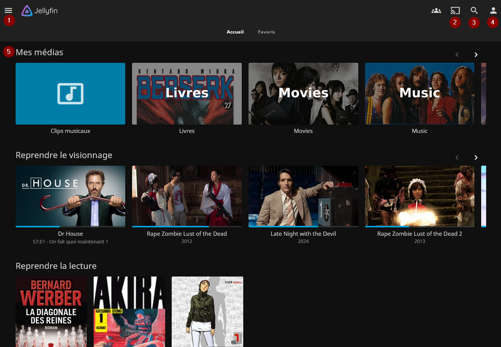
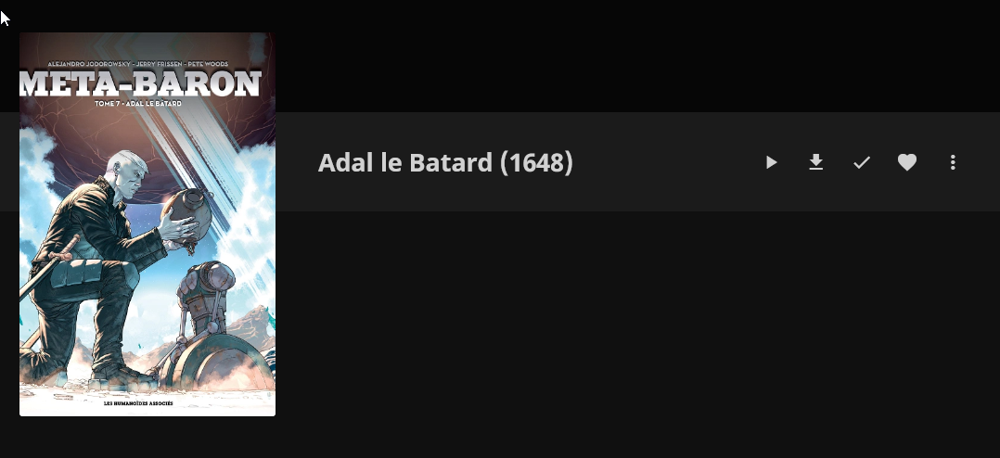
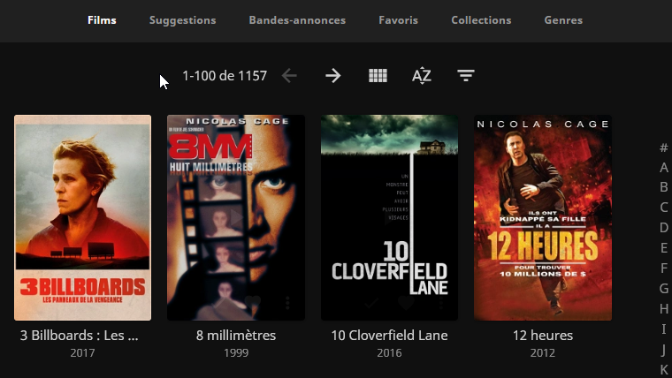
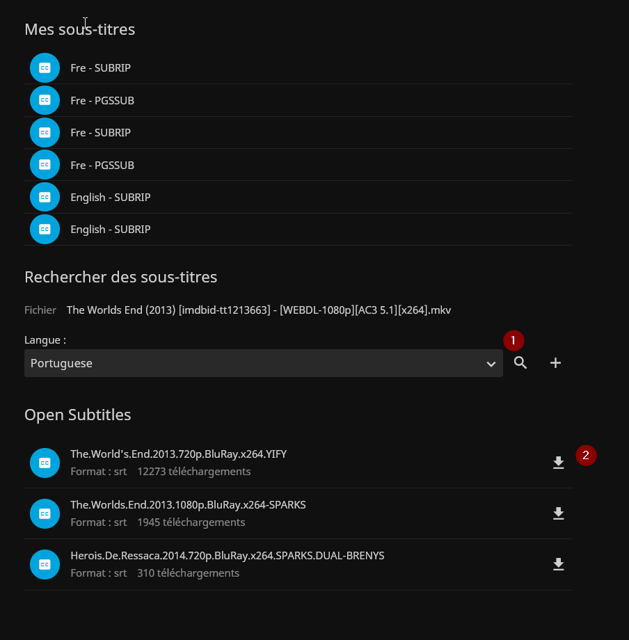

# Jellyfin	
Jellyfin is a mediacenter, that you can access after you're received credentials from me (shared with [Jellyseerr](/jellyseerr) ).

It's available through various means
- On the web, by clicking [on this link](https://jellyfin.ktgn.net)
- Via an app ([Android](/https://play.google.com/store/apps/details?id=org.jellyfin.mobile), [Apple](/https://apps.apple.com/us/app/jellyfin-mobile/id1480192618?mt=8) or [TV Android](/https://play.google.com/store/apps/details?id=org.jellyfin.androidtv))

According to your TV specs, you may be able to "cast" the videos to your TV from your phone. 

> This documentation is taking the web version as example. On other means, it should be quite the same.
{.is-info}

## Connexion

Can't be simpler : just enter your username and password. Quick connect is there for special hardware like you TV, or gaming console, on which you don't have a proper keyboard.

{.align-center}

## Home

1. Sidebar (Shortcuts to libraries and user settings)
2. "Cast" to another compatible screen. Handy if you want to browse the mediacenter on your phone but see on the TV.
3. Search for a title
4. User settings
5. Main part

{.align-center}

### User settings

here you can customize your user experience...  Normally, you shouldn't have anything to change here...

- Profile  (to change password)
- Quick Connect (to be used when you want to connect to a TV or a gaming console)
- Display (To change certain graphical options, time, language of the interface, etc...)
- Home (to change your homescreen, hide certain sections, etc...)
- Playback (To change video quality, favored language when available, etc... )
- Subtitles (Subtitle preferences)
- Control (to activate joystick navigation)

### Main navigation

> Please note that when you hover your mouse over a thumbnail, a **Play** button will appear.
This starts playback straight away. If you want to see a media file, click on the title below. 
{.is-danger}

The first line contains the libraries. You can scroll through them using the little arrow at the top right.
Click on the thumbnail to see the details of the libraries.

I have added categories with only english/german/spanish content. The "movies" and "tvshows" categories wil contain mainly french stuff. 

The other lines allow you to see the most recently started media, and then the recent additions below.

#### Books
In Jellyfin, books are classified by author. It's pretty basic, you need to enter an author to see a list of his or her titles.

{.align-center}

If you click Play, the title will load into memory, which can take considerably longer for graphic formats. Navigating between pages is simply a matter of using the keyboard. 

The check mark indicates that you have already read the book, and the heart allows you to add it to a list of favourites.

If you click on the title, you'll be taken to the book description. This is only useful if you want to download a local copy (via the second icon ⬇️).

{.align-center}

#### Movies

The interface is a little more cluttered here... In the top navigation, there are three important tabs:

- Films, the one you're basically in
- Suggestions, which suggests films based on what you've already seen.
- Genres, which classifies films according to genre. Well, it's a very... creative classification, you might say. 

On the right of the screen, you can display only films with a certain letter. 

{.align-center}

When you click on a movie name, you'll land on movies details

1. To change between audio tracks, if available
2. To change subtitles. I'll explain a bit below how to get new ones if there is one missing. 
3. Play the movie
4. Play a trailer
5. Chekc to set the movie as already played
6. Check to add the movie to your liked ones.
7. Various options (see below)

{.align-center}

##### Download movie offline and subtitles

Here are two very useful options. You can download a movie to your device. Ideal when you plan a trip and want to download some movies beforehand. You can also seach for subtitles!

{.align-center}

It's pretty simple. Just select a language, click search button and select one of the results. Favoring the most downloaded one usually yields the best results. 

{.align-center}

##### Filters and sorting

- Arrows, to navigate between pages
- View, to change the presentation of the list
- Sorting
- Filtering

{.align-center}

#### Music
Here is my music, organized in different tabs. Easiest way to navigate here is by artist, or genre, maybe. 

#### TV shows
It's the same is in movies, except you'll have the seasons list on the first screen, then you can see the detailed episodes list. 

### Content playback

1. Change subtitles
2. Change audio track
3. Change playback speed, quality, format

> Changing the format won't take away black bands **integrated inside** the file sadly.
{.is-info}

{.align-center}

